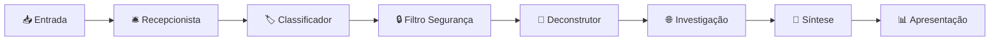

# 🔍 Investiga.AI
### Sistema Automatizado de Verificação de Fatos com IA Multi-Agente

<div align="center">

[](https://www.python.org/downloads/)
[](https://fastapi.tiangolo.com/)
[](https://pytorch.org/)
[](https://huggingface.co/transformers/)
[](LICENSE)
[](#testes)

**Combate à desinformação através de verificação automatizada inteligente**

[🚀 Início Rápido](#início-rápido) • [📖 Documentação](docs/) • [🎯 Demo](#demo) • [🤝 Contribuir](#contribuindo)

---

</div>

## 🌟 Visão Geral

O **Investiga.AI** é um sistema avançado de verificação automatizada de fatos que utiliza múltiplos agentes de IA especializados em uma arquitetura de **Pipeline de Agentes Heterogêneos em Cascata (CHAP)**. O sistema analisa alegações em diversos formatos, investiga evidências na web e gera vereditos fundamentados com explicações claras.

### ✨ Características Principais

| Funcionalidade | Descrição |
|----------------|-----------|
| 🔍 **Investigação Automatizada** | Busca evidências em fontes autoritativas da web |
| 🧠 **IA Multimodal** | Processa texto, imagem, áudio e vídeo |
| ⚡ **Processamento em Tempo Real** | Cache inteligente e otimizações GPU |
| 🛡️ **Arquitetura Resiliente** | Circuit breakers e recuperação automática |
| 📊 **Explicabilidade Completa** | Fornece fontes, raciocínio e trilha de auditoria |
| 🌐 **API RESTful** | Integração fácil com outros sistemas |

### 🎯 Casos de Uso

- **📺 Mídia e Jornalismo**: Verificação de notícias em tempo real
- **🏛️ Setor Público**: Combate à desinformação institucional  
- **🎓 Pesquisa Acadêmica**: Verificação de literatura científica
- **👥 Redes Sociais**: Detecção de fake news

## 🏗️ Arquitetura do Sistema



### Pipeline de 7 Etapas

1. **🛎️ Recepcionista**: Estrutura e organiza a entrada
2. **🏷️ Classificador**: Identifica tipo e modalidade do conteúdo
3. **🔒 Filtro Segurança**: Detecta URLs maliciosos e conteúdo perigoso
4. **🔧 Deconstrutor**: Extrai alegações específicas e verificáveis
5. **🌐 Investigação**: Busca evidências em fontes autoritativas
6. **🎯 Síntese**: Analisa evidências e gera conclusão fundamentada
7. **📊 Apresentação**: Formata resultado em linguagem clara

## 🚀 Início Rápido

### Pré-requisitos

- Python 3.11+
- 8GB+ RAM recomendado
- GPU opcional (para melhor performance)

### Instalação

```bash
# Clone o repositório
git clone https://github.com/seu-usuario/investiga-ai.git
cd investiga-ai

# Crie ambiente virtual
python -m venv venv
source venv/bin/activate  # Linux/Mac
# venv\Scripts\activate   # Windows

# Instale dependências
pip install -r requirements.txt

# Execute testes de verificação
./tests/executar_teste_fase1.sh
```

### Uso Básico

#### 🔥 Verificação Rápida (1 segundo)
```python
from src.agentes.coordenador_agentes import CoordenadorAgentes

# Inicializa o verificador
verificador = CoordenadorAgentes()

# Verifica uma alegação
resultado = verificador.processar_rapido(
    "O governo gastou R$ 100 bilhões em saúde em 2024"
)

print(f"Resultado: {resultado['veredicto_rapido']}")
print(f"Recomendação: {resultado['recomendacao']}")
```

#### 🌐 Verificação Completa (30 segundos)
```python
import asyncio

async def verificacao_detalhada():
    verificador = CoordenadorAgentes()
    
    resultado = await verificador.processar_completo_com_sintese(
        "Alegação a ser investigada completamente"
    )
    
    # Resultado detalhado
    conclusao = resultado['sintese']['conclusao_sintese']
    print(f"📋 Veredicto: {conclusao['veredicto']}")
    print(f"💡 Confiança: {conclusao['confianca']:.2f}")
    print(f"🔍 Raciocínio: {conclusao['reasoning']}")

# Executa
asyncio.run(verificacao_detalhada())
```

#### 🌐 API REST
```bash
# Inicia o servidor
python main.py

# Em outro terminal, teste a API
curl -X POST "http://localhost:8000/api/verify" \
     -H "Content-Type: application/json" \
     -d '{"conteudo": "Informação a ser verificada"}'
```

## 📊 Modos de Operação

| Modo | Tempo | Funcionalidades |
|------|-------|----------------|
| 🚀 **Rápido** | ~1s | Verificação básica sem busca web |
| 🔍 **Completo** | ~10s | Análise com agentes de IA |
| 🌐 **Com Web** | ~30s | + Investigação em fontes online |
| 🎯 **Síntese** | ~45s | + Veredicto final detalhado |

## 🧪 Testes

O sistema possui 6 fases de testes organizadas:

```bash
# Executa todas as fases
for fase in {1..6}; do ./tests/executar_teste_fase${fase}.sh; done

# Ou execute fases individuais
./tests/executar_teste_fase1.sh  # Infraestrutura
./tests/executar_teste_fase2.sh  # Agentes IA
./tests/executar_teste_fase3.sh  # Cache e Reasoning
./tests/executar_teste_fase4.sh  # Investigação Web
./tests/executar_teste_fase5.sh  # Síntese Final
./tests/executar_teste_fase6.sh  # Orquestração Avançada
```

## 📁 Estrutura do Projeto

```
investiga-ai/
├── 📄 README.md
├── 🐍 main.py                    # API FastAPI
├── 📋 requirements.txt
├── 📁 src/
│   ├── 🤖 agentes/              # Agentes especializados
│   ├── 🔍 investigacao/         # Investigação web
│   ├── 🎯 sintese/              # Síntese final
│   ├── 🏗️ infraestrutura/       # Infraestrutura base
│   ├── 🎛️ orquestracao/         # Orquestração avançada
│   └── ⚙️ config/               # Configurações
├── 🧪 tests/                    # Testes em 6 fases
└── 📖 docs/                     # Documentação detalhada
```

## 🛠️ Tecnologias Utilizadas

<div align="center">


</div>

### Stack Principal

- **🐍 Python 3.11+**: Linguagem principal
- **🔥 PyTorch**: Framework de IA
- **🤗 Transformers**: Modelos de linguagem
- **⚡ FastAPI**: API REST moderna
- **🖼️ Pillow**: Processamento de imagens
- **🌐 BeautifulSoup**: Web scraping
- **📊 psutil/GPUtil**: Monitoramento de recursos

## 📖 Documentação

| Documento | Descrição |
|-----------|-----------|
| [🏗️ Arquitetura](docs/arquitetura.md) | Design e componentes do sistema |
| [⚙️ Instalação](docs/instalacao.md) | Guia completo de instalação |
| [🔧 Configuração](docs/configuracao.md) | Personalização e ajustes |
| [🌐 API](docs/api.md) | Referência completa da API |
| [🤝 Contribuição](docs/contribuicao.md) | Como contribuir para o projeto |
| [❓ FAQ](docs/faq.md) | Perguntas frequentes |

## 🤝 Contribuindo

Contribuições são muito bem-vindas! Veja nosso [Guia de Contribuição](docs/contribuicao.md).

### Como Contribuir

1. 🍴 Fork o projeto
2. 🌿 Crie uma branch (`git checkout -b feature/nova-funcionalidade`)
3. 💾 Commit suas mudanças (`git commit -am 'Adiciona nova funcionalidade'`)
4. 📤 Push para a branch (`git push origin feature/nova-funcionalidade`)
5. 🔄 Abra um Pull Request

### Reportar Problemas

- 🐛 [Reportar Bug](../../issues/new?template=bug_report.md)
- ✨ [Solicitar Feature](../../issues/new?template=feature_request.md)
- ❓ [Fazer Pergunta](../../discussions)

## 📊 Estatísticas do Projeto

<div align="center">


</div>

## 📄 Licença

Este projeto está licenciado sob a Licença MIT - veja o arquivo [LICENSE](LICENSE) para detalhes.

```
MIT License - Uso livre para fins comerciais e não comerciais
✅ Uso comercial    ✅ Modificação    ✅ Distribuição    ✅ Uso privado
❌ Responsabilidade ❌ Garantia
```

## 🙏 Agradecimentos

- **🤗 HuggingFace**: Modelos de linguagem e frameworks
- **🔥 PyTorch Team**: Framework de deep learning
- **⚡ FastAPI**: Framework web moderno
- **🌐 Comunidade Open Source**: Bibliotecas e ferramentas utilizadas

## 📞 Contato

- 📧 **Email**: contato@investiga-ai.com
- 🐦 **Twitter**: [@InvestigaAI](https://twitter.com/InvestigaAI)
- 💼 **LinkedIn**: [Investiga.AI](https://linkedin.com/company/investiga-ai)
- 🌐 **Website**: [investiga-ai.com](https://investiga-ai.com)

---

<div align="center">

**Combatendo a desinformação com inteligência artificial** 🤖

[](#)
[](#)

</div>