# 🏗️ Arquitetura do Sistema Investiga.AI

<div align="center">

[](#chap)
[](#agentes)
[](#multimodal)

**Pipeline de Agentes Heterogêneos em Cascata para Verificação de Fatos**

</div>

---

## 📋 Índice

- [🎯 Visão Geral](#visão-geral)
- [🔄 Pipeline CHAP](#pipeline-chap)
- [🤖 Agentes Especializados](#agentes-especializados)
- [🏗️ Camadas da Arquitetura](#camadas-da-arquitetura)
- [🔄 Fluxo de Dados](#fluxo-de-dados)
- [🛡️ Resiliência e Recuperação](#resiliência-e-recuperação)
- [📊 Monitoramento](#monitoramento)

---

## 🎯 Visão Geral

O **Investiga.AI** implementa uma arquitetura inovadora baseada no conceito de **Pipeline de Agentes Heterogêneos em Cascata (CHAP)**, onde múltiplos agentes especializados trabalham em sequência para realizar a verificação de fatos de forma eficiente e precisa.

### 🏛️ Princípios Arquiteturais

| Princípio | Descrição |
|-----------|-----------|
| **🔄 Especialização** | Cada agente tem uma função específica e otimizada |
| **⚡ Eficiência** | Circuit breakers param processamento desnecessário |
| **🛡️ Resiliência** | Recuperação automática de falhas |
| **📊 Observabilidade** | Monitoramento completo de métricas e logs |
| **🎯 Escalabilidade** | Suporte a processamento paralelo e distribuído |

---

## 🔄 Pipeline CHAP

### Fluxo Principal

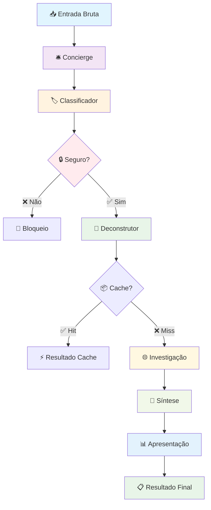

### ⚡ Circuit Breakers

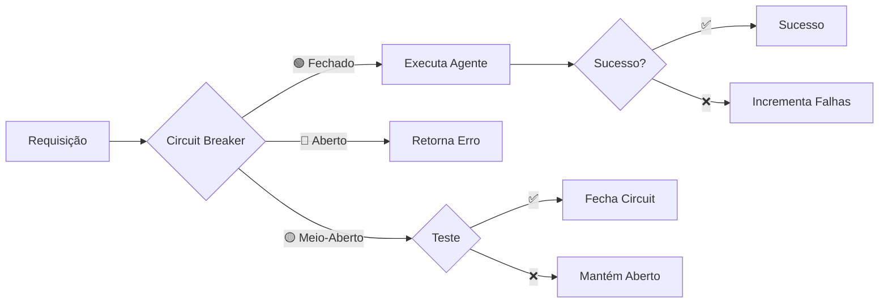

---

## 🤖 Agentes Especializados

### 1. 🛎️ Concierge (Recepcionista)
**Responsabilidade**: Estruturação e organização da entrada

```python
@dataclass
class EntradaEstruturada:
    conteudo_original: str
    tipo_conteudo: str
    alegacoes_detectadas: List[str]
    urls_encontradas: List[str]
    contexto_detalhado: str
    prioridade_verificacao: int
    metadata: Dict
```

**Características**:
- 🔍 Extração de URLs automática
- 📝 Identificação preliminar de alegações
- 🏷️ Categorização do tipo de conteúdo
- ⚖️ Atribuição de prioridade

### 2. 🏷️ Classificador Multimodal
**Responsabilidade**: Análise e classificação do conteúdo

```python
@dataclass
class ClassificacaoConteudo:
    tipo_principal: str
    modalidades_detectadas: List[str]
    necessita_processamento_visual: bool
    necessita_processamento_audio: bool
    complexidade_visual: int
    recomendacao_pipeline: str
    elementos_detectados: dict
    confianca_classificacao: float
```

**Capacidades**:
- 📄 Processamento de texto
- 🖼️ Análise de imagens (Phi-3-Vision)
- 🎵 Transcrição de áudio (Distil-Whisper)
- 🎬 Processamento de vídeo
- 🔍 Detecção de elementos visuais

### 3. 🔒 Filtro de Segurança
**Responsabilidade**: Detecção de ameaças e conteúdo malicioso

```python
@dataclass
class AvaliacaoSeguranca:
    seguro: bool
    score_confianca: float
    ameacas_detectadas: List[str]
    urls_maliciosas: List[str]
    tentativas_injection: List[str]
    recomendacao: str
    bloqueio_necessario: bool
```

**Proteções**:
- 🔗 Detecção de URLs maliciosas
- 💉 Prevenção de prompt injection
- 🛡️ Filtros de conteúdo perigoso
- 🚨 Sistema de alertas

### 4. 🔧 Deconstrutor
**Responsabilidade**: Extração de alegações verificáveis

```python
@dataclass
class AllegacaoExtraida:
    texto_original: str
    tipo: str
    entidades: List[str]
    verificabilidade: float
    prioridade: int
```

**Funcionalidades**:
- 🎯 Identificação de alegações factuais
- 🏷️ Extração de entidades (NER)
- 📊 Avaliação de verificabilidade
- 🔄 Hierarquização por prioridade

### 5. 🌐 Investigador Web
**Responsabilidade**: Coleta de evidências online

**Componentes**:
- **📋 Gerador de Estratégias**: Cria planos de busca otimizados
- **🔍 Executor de Buscas**: Realiza buscas em motores especializados
- **⚖️ Avaliador de Credibilidade**: Analisa confiabilidade das fontes
- **🔄 Detector de Contradições**: Identifica inconsistências

### 6. 🎯 Sintetizador
**Responsabilidade**: Consolidação de evidências

```python
@dataclass
class ConclusaoSintese:
    veredicto: str
    confianca: float
    reasoning: str
    evidencias_suporte: List[Dict]
    evidencias_contra: List[Dict]
    limitacoes: List[str]
    recomendacoes: List[str]
```

**Capacidades**:
- 🧠 Análise de evidências
- ⚖️ Resolução de contradições
- 📊 Cálculo de confiança
- 📝 Geração de raciocínio

### 7. 📊 Apresentador
**Responsabilidade**: Formatação do resultado final

```python
@dataclass
class RespostaFormatada:
    veredicto_principal: str
    explicacao_simples: str
    detalhes_tecnicos: str
    fontes_citadas: List[Dict]
    proximos_passos: List[str]
    timestamp: str
    disclaimer: str
```

---

## 🏗️ Camadas da Arquitetura

### 📚 Camada 1: Infraestrutura Base

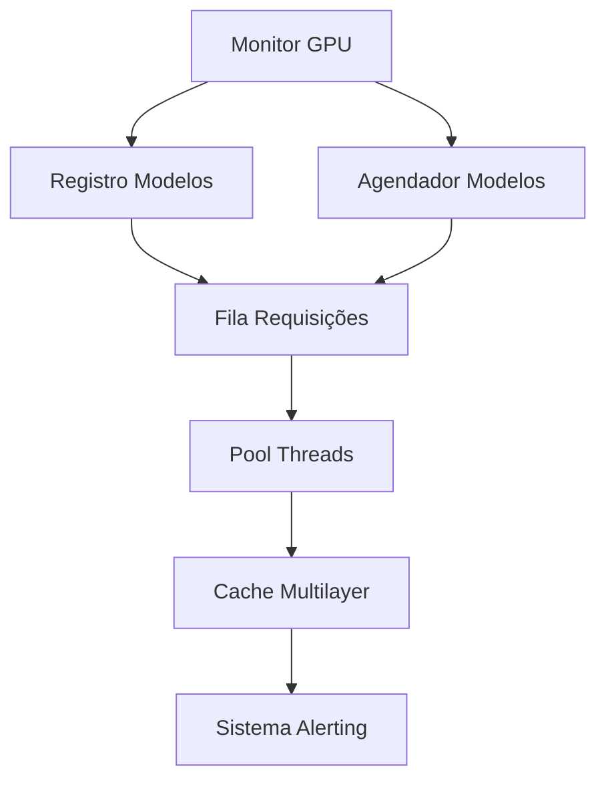

**Componentes**:
- 🖥️ **Monitor GPU**: Monitoramento de recursos em tempo real
- 📋 **Registro Modelos**: Catálogo de modelos e metadados
- ⏰ **Agendador**: Carregamento inteligente de modelos
- 📬 **Filas**: Gerenciamento de requisições concorrentes
- 🧵 **Pool Threads**: Execução paralela otimizada
- 💾 **Cache**: Sistema de cache em múltiplas camadas
- 🚨 **Alerting**: Monitoramento e notificações

### 🤖 Camada 2: Agentes Especializados

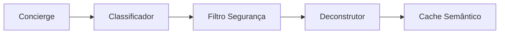

### 🔍 Camada 3: Investigação

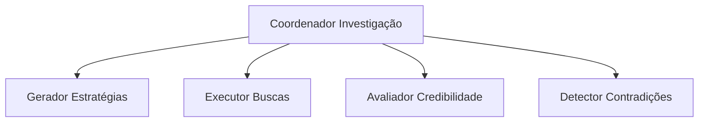

### 🎯 Camada 4: Síntese

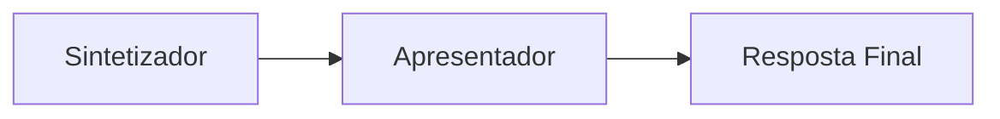

### 🎛️ Camada 5: Orquestração Avançada

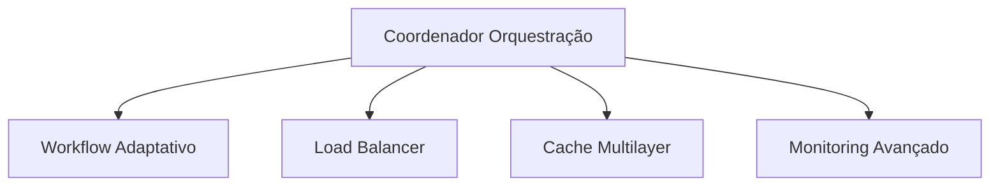

---

## 🔄 Fluxo de Dados

### 📊 Estados do Processamento

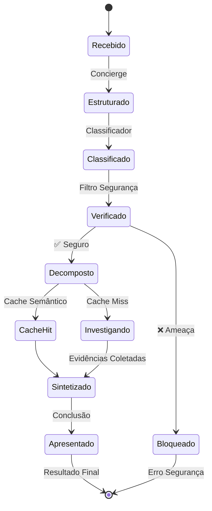

### 📈 Métricas de Performance

| Métrica | Valor Típico | Descrição |
|---------|--------------|-----------|
| **⚡ Latência Rápida** | ~1s | Processamento sem investigação web |
| **🔍 Latência Completa** | ~30s | Pipeline completo com web |
| **📊 Throughput** | 100+ req/min | Requisições processadas |
| **💾 Cache Hit Rate** | ~60% | Taxa de acerto do cache |
| **🎯 Precisão** | ~85% | Acurácia das verificações |

---

## 🛡️ Resiliência e Recuperação

### 🔄 Circuit Breakers

```python
class EstadoCircuit(Enum):
    FECHADO = "fechado"      # Funcionamento normal
    ABERTO = "aberto"        # Bloqueando requisições
    MEIO_ABERTO = "meio_aberto"  # Testando recuperação
```

**Configuração Padrão**:
- 🔢 **Limite de Falhas**: 5 falhas consecutivas
- ⏱️ **Timeout**: 30 segundos para reabertura
- 🧪 **Teste**: 1 requisição de teste no estado meio-aberto

### 🔄 Recovery Automático

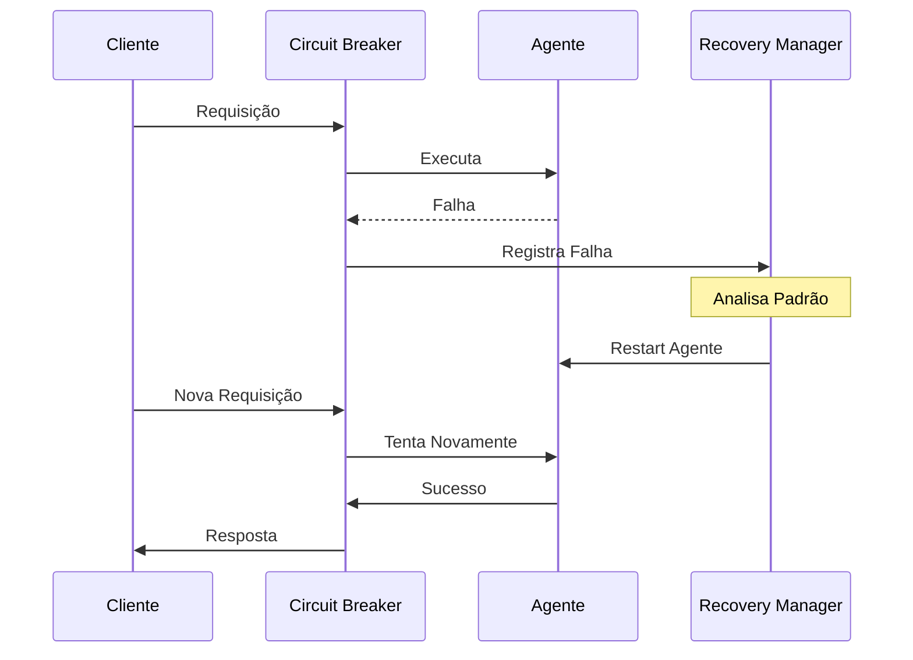

### 🏥 Health Checks

```python
async def diagnostico_sistema() -> Dict[str, Any]:
    return {
        "pipeline_basico": "OK" | "ERRO",
        "investigador_web": "OK" | "INDISPONIVEL", 
        "sintetizador": "OK" | "INDISPONIVEL",
        "agentes_status": {...},
        "status_geral": "OK" | "PARCIAL" | "ERRO_CRITICO"
    }
```

---

## 📊 Monitoramento

### 📈 Métricas Coletadas

#### Sistema
- 🖥️ **CPU/GPU**: Utilização e memória
- 🧵 **Threads**: Pool de execução
- 📊 **Latência**: Tempo de resposta por componente

#### Aplicação  
- 📬 **Requisições**: Total, sucessos, falhas
- 🎯 **Agentes**: Performance individual
- 💾 **Cache**: Hit rate, tamanho, evictions

#### Negócio
- ✅ **Verificações**: Vereditos por categoria
- 🌐 **Investigações**: Fontes consultadas
- 📊 **Confiança**: Distribuição de scores

### 🚨 Alertas Configurados

| Alerta | Threshold | Ação |
|--------|-----------|------|
| **🔥 CPU Alto** | >85% | Warning |
| **💾 Memória Crítica** | >90% | Critical |
| **📉 Taxa Erro** | >10% | Warning |
| **⏱️ Latência Alta** | >60s | Warning |
| **🚫 Circuit Aberto** | N/A | Critical |

### 📊 Dashboard Tempo Real

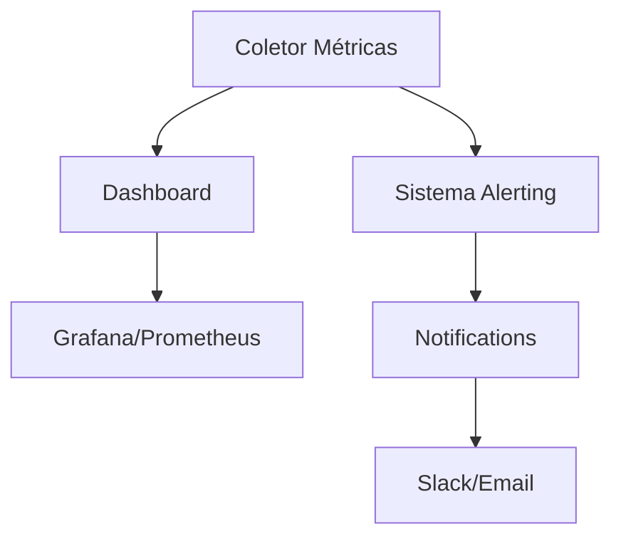

---

## 🔧 Configurações Avançadas

### ⚙️ Configuração de Modelos

```python
@dataclass
class MetadadosModelo:
    nome: str
    caminho: str
    tipo_modelo: str
    memoria_necessaria_mb: float
    quantizacao: TipoQuantizacao
    especialidade: str
    versao: str
    prioridade: int
    dependencias: List[str]
    configuracoes: Dict[str, any]
```

### 🎛️ Configuração do Sistema

```python
@dataclass
class ConfiguracoesSistema:
    gpu: ConfiguracaoGPU
    scheduler: ConfiguracaoScheduler  
    filas: ConfiguracaoFilas
    diretorio_modelos: str
    nivel_log: str
```

---

## 🚀 Otimizações de Performance

### ⚡ Cache Estratificado

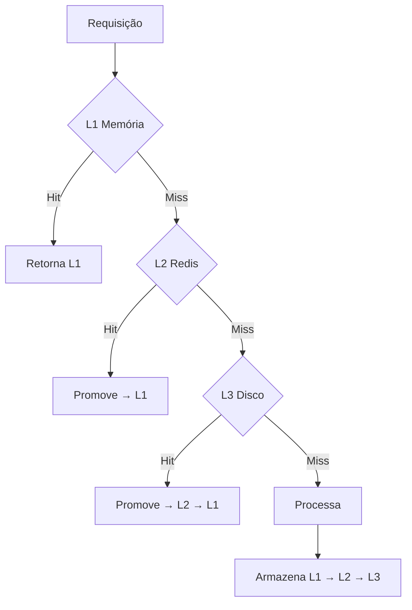

### 🧠 Preloading Preditivo

```python
class AnalisadorPadroes:
    def prever_proximos_modelos(self, modelo_atual: str) -> List[str]:
        # Análise de padrões de uso
        # Predição de próximos modelos necessários
        # Carregamento antecipado
```

### 🎯 Load Balancing Inteligente

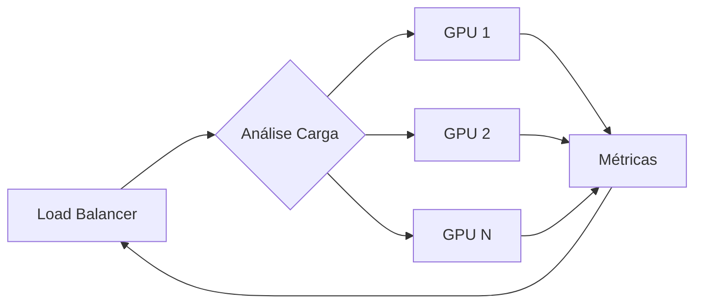

---

## 📚 Próximos Passos

Para implementar melhorias na arquitetura:

1. **📖 [Guia de Instalação](instalacao.md)** - Setup completo
2. **⚙️ [Configuração Avançada](configuracao.md)** - Personalização
3. **🌐 [API Reference](api.md)** - Integração
4. **🤝 [Contribuição](contribuicao.md)** - Como ajudar

---

<div align="center">

**🏗️ Arquitetura robusta para combater a desinformação**

[](../README.md)

</div>