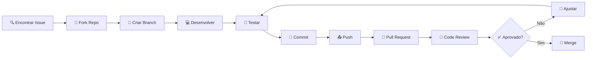

# 🤝 Guia de Contribuição - Investiga.AI

<div align="center">

[](#como-contribuir)
[](#código-de-conduta)
[](#licença)

**Juntos contra a desinformação! 🛡️**

[🚀 Início Rápido](#início-rápido) • [🔧 Setup Desenvolvimento](#setup-desenvolvimento) • [📋 Processo](#processo-de-contribuição) • [🎯 Áreas](#áreas-de-contribuição)

</div>

---

## 📋 Índice

- [🌟 Por que Contribuir](#por-que-contribuir)
- [🚀 Início Rápido](#início-rápido)
- [🔧 Setup Desenvolvimento](#setup-desenvolvimento)
- [📋 Processo de Contribuição](#processo-de-contribuição)
- [🎯 Áreas de Contribuição](#áreas-de-contribuição)
- [📝 Diretrizes](#diretrizes)
- [🧪 Testes](#testes)
- [🐛 Reportando Bugs](#reportando-bugs)
- [✨ Solicitando Features](#solicitando-features)
- [📖 Documentação](#documentação)
- [👥 Código de Conduta](#código-de-conduta)

---

## 🌟 Por que Contribuir?

O **Investiga.AI** é uma ferramenta crucial no combate à desinformação. Sua contribuição pode:

- 🛡️ **Combater fake news** e proteger a democracia
- 🌍 **Impactar milhões** de pessoas globalmente
- 🧠 **Avançar a ciência** de verificação automatizada
- 🤝 **Construir comunidade** de desenvolvedores engajados
- 📚 **Aprender tecnologias** de ponta em IA e ML

### 🏆 Reconhecimento

Todos os contribuidores são reconhecidos:
- 📋 **Contributors page** com perfil e contribuições
- 🏅 **Badges especiais** para contribuições significativas
- 🎉 **Mention nas releases** quando suas contribuições são incluídas
- 💼 **Portfolio boost** com projeto de impacto social

---

## 🚀 Início Rápido

### 1️⃣ Encontre uma Issue

```bash
# Procure por labels amigáveis para iniciantes:
good first issue    # 🟢 Boa primeira contribuição
help wanted        # 🆘 Ajuda necessária
documentation     # 📖 Melhorias na documentação
bug              # 🐛 Correção de bugs
enhancement      # ✨ Novas funcionalidades
```

### 2️⃣ Fork e Clone

```bash
# Fork no GitHub, depois:
git clone https://github.com/SEU-USUARIO/investiga-ai.git
cd investiga-ai
```

### 3️⃣ Crie Branch

```bash
git checkout -b feature/minha-contribuicao
```

### 4️⃣ Desenvolva e Teste

```bash
# Sua magia acontece aqui ✨
./tests/executar_teste_fase1.sh
```

### 5️⃣ Submeta PR

```bash
git add .
git commit -m "feat: adiciona funcionalidade X"
git push origin feature/minha-contribuicao
# Abra PR no GitHub
```

---

## 🔧 Setup Desenvolvimento

### 📋 Pré-requisitos

- **🐍 Python 3.11+**
- **📦 Git**
- **🔧 IDE recomendado**: VS Code, PyCharm
- **🎮 GPU opcional** para desenvolvimento com IA

### 🛠️ Configuração Completa

```bash
# 1. Clone e entre no diretório
git clone https://github.com/SEU-USUARIO/investiga-ai.git
cd investiga-ai

# 2. Configure ambiente virtual
python3.11 -m venv venv-dev
source venv-dev/bin/activate  # Linux/macOS
# venv-dev\Scripts\activate   # Windows

# 3. Instale dependências de desenvolvimento
pip install --upgrade pip
pip install -r requirements.txt
pip install -r requirements-dev.txt  # Se existir

# 4. Configure pre-commit hooks
pip install pre-commit
pre-commit install

# 5. Configure IDE
cp .vscode/settings.example.json .vscode/settings.json  # VS Code
# ou configure seu IDE preferido

# 6. Execute testes iniciais
./tests/executar_teste_fase1.sh
```

### ⚙️ Configuração de Desenvolvimento

```bash
# Arquivo .env.dev
cat > .env.dev << 'EOF'
# Configurações de desenvolvimento
PYTHONPATH=./src
LOG_LEVEL=DEBUG
DEBUG=true
CACHE_DIR=./cache-dev
MODELS_DIR=./models-dev

# API de desenvolvimento
API_HOST=127.0.0.1
API_PORT=8001

# Configurações relaxadas para dev
GPU_THRESHOLD_CRITICO=95.0
FILAS_MAX_CONCURRENT=1
EOF
```

### 🧰 Ferramentas de Desenvolvimento

#### 📝 Linting e Formatação
```bash
# Black (formatação)
black src/ tests/

# Flake8 (linting)
flake8 src/ tests/

# isort (imports)
isort src/ tests/

# mypy (type checking)
mypy src/
```

#### 🧪 Testes
```bash
# Todos os testes
python -m pytest

# Testes específicos
python -m pytest tests/fase1/
python -m pytest tests/test_agentes.py -v

# Com cobertura
python -m pytest --cov=src --cov-report=html
```

#### 📊 Profiling
```bash
# Profile de performance
python -m cProfile -o profile.stats main.py

# Análise de memória
python -m memory_profiler scripts/benchmark.py
```

---

## 📋 Processo de Contribuição

### 🔄 Workflow Completo



### 🌿 Convenções de Branch

| Tipo | Formato | Exemplo |
|------|---------|---------|
| **🆕 Feature** | `feature/descrição` | `feature/cache-semantico` |
| **🐛 Bugfix** | `bugfix/descrição` | `bugfix/memory-leak-gpu` |
| **📖 Docs** | `docs/descrição` | `docs/api-reference` |
| **🧪 Teste** | `test/descrição` | `test/unit-deconstrutor` |
| **🔧 Refactor** | `refactor/descrição` | `refactor/agent-interface` |
| **⚡ Performance** | `perf/descrição` | `perf/faster-embeddings` |

### 💬 Convenções de Commit

Seguimos [Conventional Commits](https://conventionalcommits.org/):

```bash
# Formato
<tipo>[escopo opcional]: <descrição>

[corpo opcional]

[rodapé opcional]
```

#### 📋 Tipos de Commit

| Tipo | Descrição | Exemplo |
|------|-----------|---------|
| **feat** | Nova funcionalidade | `feat(agentes): adiciona cache semântico` |
| **fix** | Correção de bug | `fix(api): corrige timeout websocket` |
| **docs** | Documentação | `docs(readme): atualiza guia instalação` |
| **style** | Formatação/estilo | `style: aplica black formatting` |
| **refactor** | Refatoração | `refactor(core): simplifica pipeline` |
| **test** | Testes | `test(unit): adiciona testes deconstrutor` |
| **chore** | Manutenção | `chore: atualiza dependências` |
| **perf** | Performance | `perf(gpu): otimiza carregamento modelos` |

#### 💡 Exemplos de Commits

```bash
# ✅ Bons commits
feat(investigacao): implementa busca paralela em múltiplas fontes
fix(cache): corrige race condition no cache semântico
docs(api): adiciona exemplos de uso WebSocket
test(e2e): adiciona testes end-to-end do pipeline
perf(gpu): otimiza alocação de memória CUDA

# ❌ Commits a evitar
fix: bug
update code
changes
wip
```

### 🔄 Pull Request

#### 📝 Template de PR

```markdown
## 📋 Descrição
Breve descrição das mudanças realizadas.

## 🎯 Tipo de Mudança
- [ ] 🐛 Bug fix
- [ ] ✨ Nova funcionalidade
- [ ] 💥 Breaking change
- [ ] 📖 Documentação
- [ ] 🧪 Testes

## 🧪 Como Testar
Descreva os passos para testar as mudanças:
1. Execute `comando1`
2. Verifique que `comportamento_esperado`

## 📋 Checklist
- [ ] Código segue as diretrizes do projeto
- [ ] Self-review realizado
- [ ] Comentários adicionados em código complexo
- [ ] Documentação correspondente atualizada
- [ ] Testes passando
- [ ] Sem conflitos com main

## 📊 Screenshots (se aplicável)
Adicione screenshots para mudanças visuais.

## 🔗 Issues Relacionadas
Closes #123
```

#### ✅ Critérios de Aprovação

- **🧪 Testes**: Todos os testes devem passar
- **📖 Documentação**: Mudanças documentadas adequadamente
- **🎯 Qualidade**: Código limpo e bem estruturado
- **⚡ Performance**: Sem regressões de performance
- **🔒 Segurança**: Sem vulnerabilidades introduzidas

---

## 🎯 Áreas de Contribuição

### 🤖 Core do Sistema

#### 🧠 Agentes de IA
```bash
# Localização: src/agentes/
- Recepcionista (estruturação)
- Classificador (multimodal)  
- Filtro Segurança (detecção ameaças)
- Deconstrutor (extração alegações)
```

**Skills necessárias**: Python, NLP, PyTorch/Transformers

**Contribuições típicas**:
- Melhorias na precisão dos modelos
- Novos tipos de processamento multimodal
- Otimizações de performance
- Novos filtros de segurança

#### 🌐 Investigação Web
```bash
# Localização: src/investigacao/
- Gerador de estratégias de busca
- Executor de buscas
- Avaliador de credibilidade
- Detector de contradições
```

**Skills necessárias**: Web scraping, APIs, análise de texto

**Contribuições típicas**:
- Novos motores de busca
- Melhor avaliação de credibilidade
- Detecção aprimorada de contradições
- Suporte a novos tipos de fontes

#### 🎯 Síntese e Apresentação
```bash
# Localização: src/sintese/
- Sintetizador de evidências
- Apresentador de resultados
```

**Skills necessárias**: NLP, lógica, UX writing

### 🏗️ Infraestrutura

#### ⚡ Performance e Escalabilidade
```bash
# Localização: src/infraestrutura/
- Monitor GPU/CPU
- Sistema de filas
- Cache multilayer
- Load balancing
```

**Skills necessárias**: Sistemas distribuídos, otimização, DevOps

#### 🛡️ Resiliência
```bash
# Localização: src/agentes/circuit_breakers.py
- Circuit breakers
- Recovery automático
- Monitoramento
```

### 🌐 API e Integração

#### 🔌 FastAPI
```bash
# Localização: main.py
- Endpoints REST
- WebSocket real-time
- Upload de arquivos
- Documentação OpenAPI
```

**Skills necessárias**: FastAPI, WebSockets, OpenAPI

#### 🛠️ SDKs
```bash
# Localização: sdks/
- Python SDK
- JavaScript/TypeScript SDK
- Documentação
```

### 📖 Documentação

#### 📚 Tipos de Documentação
- **👨‍💻 Para Desenvolvedores**: Arquitetura, APIs, contribuição
- **👥 Para Usuários**: Guias, tutoriais, FAQ
- **🔬 Para Pesquisadores**: Papers, benchmarks, metodologia

**Skills necessárias**: Escrita técnica, Markdown, diagramas

### 🧪 Testes e QA

#### 🔬 Tipos de Teste
```bash
tests/
├── fase1/  # Infraestrutura
├── fase2/  # Agentes básicos
├── fase3/  # Cache e reasoning
├── fase4/  # Investigação web
├── fase5/  # Síntese
└── fase6/  # Orquestração
```

**Skills necessárias**: pytest, testes automatizados, CI/CD

### 🎨 Frontend (Futuro)

#### 🖥️ Interface Web
- Dashboard de monitoramento
- Interface de verificação
- Visualização de resultados

**Skills necessárias**: React, TypeScript, D3.js

---

## 📝 Diretrizes

### 🐍 Código Python

#### 📋 Padrões de Qualidade
```python
# ✅ Bom: claro, documentado, tipado
async def processar_alegacao(
    alegacao: str, 
    opcoes: Optional[Dict[str, Any]] = None
) -> ResultadoVerificacao:
    """
    Processa uma alegação para verificação de fatos.
    
    Args:
        alegacao: Texto da alegação a ser verificada
        opcoes: Configurações opcionais do processamento
        
    Returns:
        Resultado estruturado da verificação
        
    Raises:
        ValueError: Se a alegação for inválida
    """
    if not alegacao.strip():
        raise ValueError("Alegação não pode estar vazia")
        
    resultado = await self._executar_pipeline(alegacao, opcoes or {})
    return resultado

# ❌ Evitar: não documentado, sem tipos
def process(text, opts=None):
    return do_stuff(text, opts)
```

#### 🏗️ Estrutura de Classes
```python
from dataclasses import dataclass
from typing import Protocol, Optional, List
from abc import ABC, abstractmethod

# Use dataclasses para estruturas de dados
@dataclass
class ConfiguracaoAgente:
    nome: str
    timeout: float = 30.0
    max_tentativas: int = 3

# Use Protocols para interfaces
class ProcessadorConteudo(Protocol):
    def processar(self, conteudo: str) -> str: ...

# Use ABC para classes base
class AgenteBase(ABC):
    @abstractmethod
    async def executar(self, entrada: str) -> str:
        """Executa o processamento do agente."""
        pass
```

#### 🚨 Tratamento de Erros
```python
# ✅ Specific errors with context
class AgenteIndisponivelError(Exception):
    """Erro quando agente não está disponível."""
    def __init__(self, nome_agente: str, motivo: str):
        self.nome_agente = nome_agente
        self.motivo = motivo
        super().__init__(f"Agente '{nome_agente}' indisponível: {motivo}")

# ✅ Proper error handling
try:
    resultado = await agente.processar(entrada)
except AgenteIndisponivelError as e:
    logger.warning(f"Agente falhou: {e}")
    # Tenta agente backup ou retorna erro graceful
    return self._usar_agente_backup(entrada)
except Exception as e:
    logger.error(f"Erro inesperado: {e}", exc_info=True)
    raise ProcessamentoError(f"Falha no processamento: {e}") from e
```

### 📝 Documentação de Código

#### 🔤 Docstrings
```python
def extrair_alegacoes(self, texto: str, opcoes: ExtractionOptions) -> List[Alegacao]:
    """
    Extrai alegações verificáveis de um texto.
    
    Este método analisa o texto fornecido usando técnicas de NLP para
    identificar statements factuais que podem ser verificados.
    
    Args:
        texto: O texto de entrada para análise
        opcoes: Configurações para personalizar a extração
        
    Returns:
        Lista de objetos Alegacao com as alegações encontradas
        
    Raises:
        ValueError: Se o texto estiver vazio ou inválido
        ProcessingError: Se ocorrer erro durante o processamento
        
    Example:
        >>> extrator = DeconstructorComplexo()
        >>> alegacoes = extrator.extrair_alegacoes(
        ...     "O governo gastou R$ 100 bilhões em 2024",
        ...     ExtractionOptions(min_confianca=0.8)
        ... )
        >>> print(len(alegacoes))
        2
    """
```

#### 💬 Comentários
```python
# ✅ Explica o "porquê", não o "o quê"
# Usamos exponential backoff para evitar spam em APIs externas
# após detecção de rate limiting
await asyncio.sleep(2 ** tentativa)

# ✅ Contexto importante
# HACK: Workaround para bug no transformers 4.30.x
# TODO: Remover após upgrade para 4.31+
if hasattr(model, '_old_forward'):
    model.forward = model._old_forward

# ❌ Comentários óbvios
# Incrementa contador
contador += 1
```

### 🧪 Testes

#### 📋 Estrutura de Testes
```python
import pytest
from unittest.mock import Mock, patch
from src.agentes.deconstrutor import DeconstructorComplexo

class TestDeconstructorComplexo:
    """Testes para o agente Deconstrutor."""
    
    @pytest.fixture
    def deconstrutor(self):
        """Fixture que cria instância do deconstrutor para testes."""
        return DeconstructorComplexo()
    
    def test_extrair_alegacoes_basico(self, deconstrutor):
        """Testa extração básica de alegações."""
        texto = "O governo gastou R$ 100 bilhões em infraestrutura."
        
        alegacoes = deconstrutor.extrair_alegacoes(texto)
        
        assert len(alegacoes) > 0
        assert any("100 bilhões" in a.texto_original for a in alegacoes)
    
    def test_extrair_alegacoes_texto_vazio(self, deconstrutor):
        """Testa comportamento com texto vazio."""
        with pytest.raises(ValueError, match="texto não pode estar vazio"):
            deconstrutor.extrair_alegacoes("")
    
    @pytest.mark.asyncio
    async def test_processamento_asincrono(self, deconstrutor):
        """Testa processamento assíncrono."""
        resultado = await deconstrutor.processar_async("Texto de teste")
        assert resultado is not None
    
    @patch('src.agentes.deconstrutor.modelo_nlp')
    def test_com_mock_modelo(self, mock_modelo, deconstrutor):
        """Testa com modelo mockado."""
        mock_modelo.extrair.return_value = ["alegação mockada"]
        
        resultado = deconstrutor.extrair_alegacoes("texto")
        
        mock_modelo.extrair.assert_called_once()
        assert len(resultado) == 1
```

---

## 🧪 Testes

### 🎯 Estratégia de Testes

#### 📊 Pirâmide de Testes
```
        🔺 E2E (10%)
       Testes completos do sistema
      
     🔶 Integração (20%)
    Testes entre componentes
   
  🔷 Unitários (70%)
 Testes de funções individuais
```

#### 🏃‍♂️ Executando Testes

```bash
# Todos os testes
python -m pytest

# Por fase
./tests/executar_teste_fase1.sh  # Infraestrutura
./tests/executar_teste_fase2.sh  # Agentes
./tests/executar_teste_fase3.sh  # Cache/Reasoning
./tests/executar_teste_fase4.sh  # Web
./tests/executar_teste_fase5.sh  # Síntese
./tests/executar_teste_fase6.sh  # Orquestração

# Com cobertura
python -m pytest --cov=src --cov-report=html

# Testes específicos
python -m pytest tests/fase2/test_agentes.py -v
python -m pytest -k "test_cache" -x

# Performance tests
python -m pytest tests/performance/ --benchmark-only
```

#### 🔧 Configuração pytest
```ini
# pytest.ini
[tool:pytest]
testpaths = tests
python_files = test_*.py
python_classes = Test*
python_functions = test_*
addopts = 
    -v
    --strict-markers
    --disable-warnings
    --tb=short
markers =
    slow: marks tests as slow
    integration: marks tests as integration tests
    gpu: marks tests that require GPU
    asyncio: marks async tests
```

---

## 🐛 Reportando Bugs

### 📋 Template de Bug Report

Quando encontrar um bug, abra uma [issue](../../issues/new) com:

```markdown
**🐛 Descrição do Bug**
Descrição clara e concisa do problema.

**🔄 Para Reproduzir**
Passos para reproduzir o comportamento:
1. Execute o comando '...'
2. Forneça entrada '...'
3. Observe erro '...'

**✅ Comportamento Esperado**
Descrição do que deveria acontecer.

**📱 Ambiente**
- OS: [ex: Ubuntu 22.04]
- Python: [ex: 3.11.5]
- Versão: [ex: 1.0.0]
- GPU: [ex: RTX 4090 / Sem GPU]

**📊 Logs**
```
Cole logs relevantes aqui
```

**📎 Arquivos Adicionais**
Screenshots, arquivos de configuração, etc.
```

### 🔍 Investigação de Bugs

#### 🧪 Debugging Básico
```bash
# Ativa modo debug
export DEBUG=true
export LOG_LEVEL=DEBUG

# Executa com logs detalhados
python main.py 2>&1 | tee debug.log

# Roda testes relacionados
python -m pytest tests/ -k "bug_relacionado" -v -s
```

#### 🔬 Debugging Avançado
```python
# Adicione breakpoints para debug
import pdb; pdb.set_trace()

# Use logging estruturado
import logging
logger = logging.getLogger(__name__)
logger.debug("Estado da variável: %s", estado, extra={"contexto": "debug"})

# Profile performance
import cProfile
cProfile.run('funcao_com_problema()', 'profile.stats')
```

---

## ✨ Solicitando Features

### 💡 Template de Feature Request

```markdown
**✨ Funcionalidade Desejada**
Descrição clara da funcionalidade.

**🎯 Problema que Resolve**
Que problema esta feature resolveria?

**💡 Solução Proposta**
Como você imagina que deveria funcionar?

**🔄 Alternativas Consideradas**
Outras soluções que você considerou?

**📊 Contexto Adicional**
Screenshots, exemplos, referências, etc.

**🎚️ Prioridade**
- [ ] Baixa - seria legal ter
- [ ] Média - melhoraria o sistema
- [ ] Alta - essencial para casos de uso importantes
- [ ] Crítica - bloqueador para adoção
```

### 🎯 Critérios de Aceitação

Features devem:
- ✅ **Alinhar com a missão** de combate à desinformação
- ✅ **Ser tecnicamente viáveis** com a arquitetura atual
- ✅ **Adicionar valor significativo** aos usuários
- ✅ **Manter performance** do sistema
- ✅ **Ser bem documentadas** e testadas

---

## 📖 Documentação

### 📚 Tipos de Documentação

#### 👨‍💻 Documentação Técnica
- **🏗️ Arquitetura**: Design de alto nível
- **🔌 API**: Endpoints e exemplos  
- **🛠️ Setup**: Instalação e configuração
- **🧪 Testes**: Como rodar e criar testes

#### 👥 Documentação de Usuário
- **🚀 Quickstart**: Primeiros passos
- **📖 Tutoriais**: Guias passo-a-passo
- **❓ FAQ**: Perguntas frequentes
- **🎯 Casos de Uso**: Exemplos práticos

### ✍️ Diretrizes de Escrita

#### 📝 Princípios
- **🎯 Clareza**: Linguagem simples e direta
- **📊 Estrutura**: Use headers, listas, tabelas
- **💡 Exemplos**: Inclua código e casos práticos
- **🔄 Atualização**: Mantenha sincronizado com código

#### 🎨 Formatação
```markdown
# Use headers hierárquicos
## Seção principal
### Subseção

# Destaque informações importantes
> ⚠️ **Atenção**: Este comando pode ser destrutivo

# Use emojis para clareza visual
✅ Funciona  ❌ Não funciona  ⚠️ Cuidado

# Code blocks com linguagem
```python
def exemplo():
    return "código bem formatado"
```

# Tabelas para comparações
| Feature | Status | Descrição |
|---------|---------|-----------|
| Cache | ✅ | Implementado |
```

---

## 👥 Código de Conduta

### 🤝 Nossa Promessa

Como membros, contribuidores e líderes, prometemos fazer da participação em nossa comunidade uma experiência livre de assédio para todos, independentemente de idade, tamanho corporal, deficiência visível ou invisível, etnia, características sexuais, identidade e expressão de gênero, nível de experiência, educação, status socioeconômico, nacionalidade, aparência pessoal, raça, religião ou identidade e orientação sexual.

### 🌟 Nossos Padrões

#### ✅ Comportamentos que Contribuem para um Ambiente Positivo:

- 🤝 **Demonstrar empatia** e bondade com outras pessoas
- 🎯 **Respeitar opiniões** diferentes, pontos de vista e experiências
- 💬 **Dar e aceitar graciosamente** feedback construtivo
- 🔄 **Aceitar responsabilidade** e pedir desculpas aos afetados por nossos erros
- 🌱 **Focar no que é melhor** não apenas para nós como indivíduos, mas para a comunidade como um todo

#### ❌ Comportamentos Inaceitáveis:

- 💬 **Linguagem ou imagens sexualizadas** e atenção ou avanços sexuais de qualquer tipo
- 🎭 **Trolling, comentários insultuosos** ou depreciativos, e ataques pessoais ou políticos
- 🔒 **Assédio público ou privado**
- 📧 **Publicar informações privadas** de outros, como endereço físico ou email, sem permissão explícita
- 🚫 **Outros comportamentos** que poderiam ser razoavelmente considerados inadequados em um ambiente profissional

### 🛡️ Aplicação

Casos de comportamento abusivo, de assédio ou de outro modo inaceitável podem ser reportados entrando em contato com a equipe do projeto em **conduct@investiga-ai.com**.

Todas as reclamações serão analisadas e investigadas prontamente e de forma justa.

### 📚 Escopo

Este Código de Conduta aplica-se dentro de todos os espaços da comunidade, e também se aplica quando um indivíduo está oficialmente representando a comunidade em espaços públicos.

---

## 🎉 Reconhecimento

### 🏆 Hall da Fama

Todos os contribuidores são listados no [Contributors](../../graphs/contributors) com:

- 📊 **Estatísticas de contribuição**
- 🏅 **Badges por tipo de contribuição**  
- 🎯 **Áreas de especialidade**

### 🎖️ Tipos de Contribuição

| Badge | Contribuição | Critério |
|-------|--------------|----------|
| 🤖 | **AI/ML Expert** | Contribuições significativas nos agentes |
| 🌐 | **Web Integration** | Melhorias na investigação web |
| 🏗️ | **Infrastructure** | Otimizações de infraestrutura |
| 📖 | **Documentation** | Melhorias substanciais na docs |
| 🧪 | **Testing** | Expansão da cobertura de testes |
| 🐛 | **Bug Hunter** | Descoberta e correção de bugs |
| 💡 | **Feature Creator** | Implementação de features importantes |
| 🌟 | **Community** | Ajuda ativa na comunidade |

### 🎁 Recompensas Especiais

- **🥇 Top Contributor**: Menção nas releases
- **🎯 Expert Badge**: Reconhecimento de especialidade  
- **📝 Blog Post**: Feature em blog posts sobre contribuições
- **🎤 Speaking**: Convites para apresentar o projeto

---

## 📞 Canais de Comunicação

### 💬 Onde Conseguir Ajuda

| Canal | Propósito | Link |
|-------|-----------|------|
| **🐛 Issues** | Bugs e feature requests | [GitHub Issues](../../issues) |
| **💬 Discussions** | Perguntas e ideias | [GitHub Discussions](../../discussions) |
| **📧 Email** | Contato direto | contact@investiga-ai.com |
| **🐦 Twitter** | Updates e announcements | [@InvestigaAI](https://twitter.com/InvestigaAI) |

### 📅 Reuniões da Comunidade

- **📊 Daily Standups**: Segunda a Sexta, 9h (Brasil)
- **🎯 Sprint Planning**: Toda segunda-feira, 14h
- **🔄 Retrospectives**: Última sexta do mês, 15h
- **🎤 Community Calls**: Primeiro sábado do mês, 10h

### 📋 Como Participar

1. **👀 Observer**: Participe das discussões
2. **🤝 Contributor**: Submeta PRs e issues
3. **🎯 Maintainer**: Ajude a revisar e gerenciar o projeto
4. **🌟 Core Team**: Participe das decisões estratégicas

---

## 🎯 Próximos Passos

Pronto para contribuir? Aqui estão algumas sugestões:

### 🟢 Para Iniciantes
1. 👀 **Explore o código** - entenda a arquitetura
2. 🧪 **Execute os testes** - familiarize-se com o sistema
3. 📖 **Leia issues marcadas** com `good first issue`
4. 🤝 **Participe das discussões** - faça perguntas

### 🟡 Para Intermediários  
1. 🐛 **Resolva bugs** de complexidade média
2. ✨ **Implemente features** pequenas
3. 📖 **Melhore documentação** existente
4. 🧪 **Adicione testes** para aumentar cobertura

### 🔴 Para Avançados
1. 🏗️ **Proponha melhorias** arquiteturais
2. ⚡ **Otimize performance** de componentes críticos
3. 🧠 **Desenvolva novos agentes** especializados
4. 🌐 **Integre novos tipos** de fontes de dados

---

<div align="center">

**🤝 Juntos, fazemos a diferença no combate à desinformação!**

[](../../issues?q=is%3Aissue+is%3Aopen+label%3A%22good+first+issue%22)
[](../README.md)

**Cada linha de código, cada bug reportado, cada melhoria na documentação nos aproxima de um mundo com menos desinformação. Obrigado por fazer parte desta missão! 🛡️**

</div>